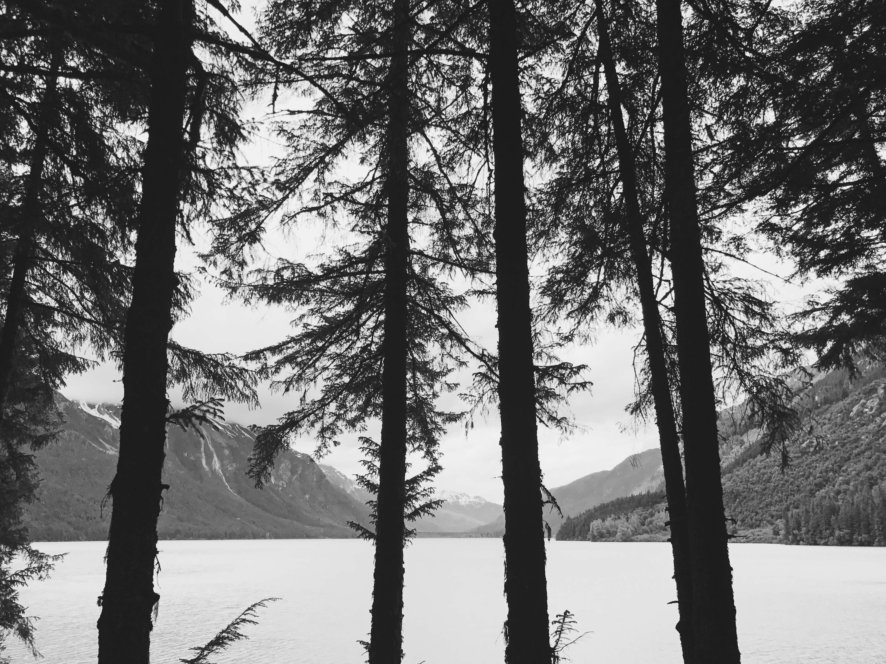

Art making and creative expression have always been important to me. I believe creating and sharing are productive both for the self and the commhnity. It allows for self-reflection in ways that are abstract and therefore boundless of many of the constraints put upon daily life. 

[Art Portfolio](https://marisahelensobel.weebly.com/all-in-time.html)

[Photography](https://www.instagram.com/mosobes/)

 

